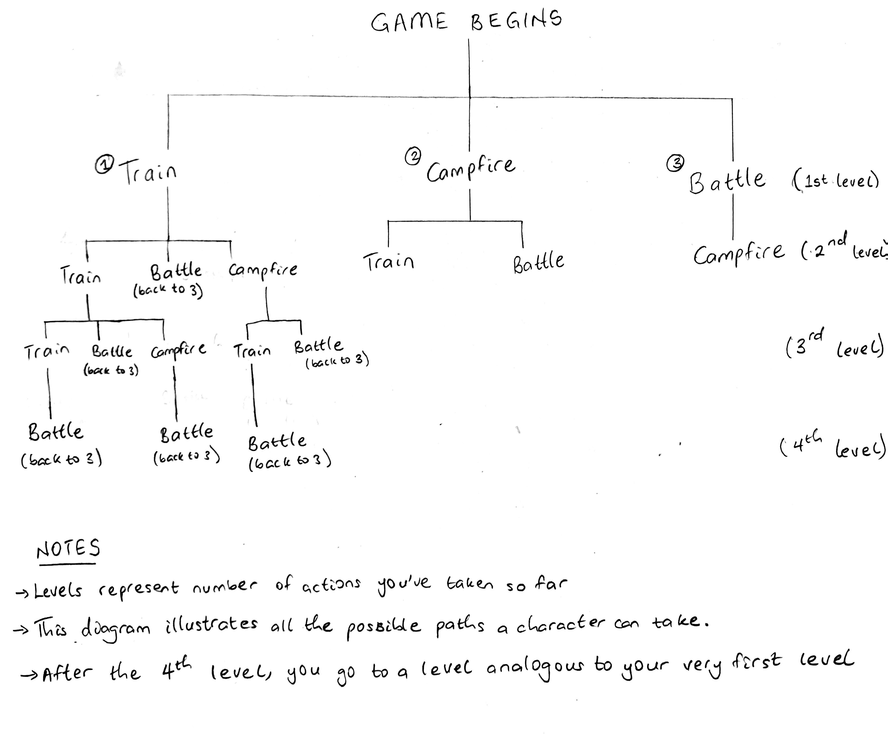
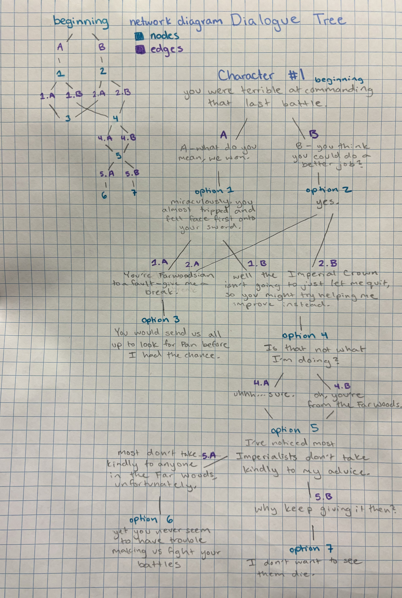
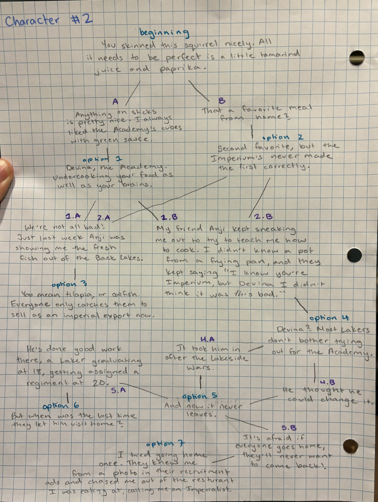

This file will contain documentation for all commands available in your game.

Note:  It's a good idea to also make this list available inside the game, in response to a `HELP` command.

train - Allows player to train two characters on their team. After each training session, the chosen characters experience goes up, and each character loses two health points.
battle - Allows player to battle bosses. The battle ends when the enemy or a character on the team dies. Health points decrease for the characters on the team who don't die.
campfire - Allows player to talk with a character on their team. Replenishes the team's health points and increases the chosen character's alliance with the user.
attack - allows the characters to deliver a blow to a boss. This can only be called when in battle mode
check stats - allows the player to the stats of all character in ther troop. This can only be called when in battle mode. 

The game ends when you've completed three battles. You win the game if you have successfully won two out of the three battles. 

Caveats: 
- When the game starts, you can train, battle or campfire
- After a battle, you must campfire
- After a campfire, you can train or battle
- After three non-battles, you must battle.
- During battle, if you choose to check stats, you give the enemy an opportunity to attack you without you returning the blow

Fastest way to go through all of the methods: battle, campfire, battle, campfire, train, battle.

